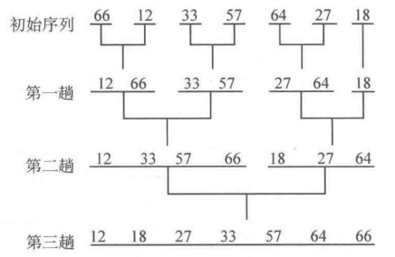

## 算法笔记

主要总结刷题过程中出现的编译出错、逻辑出错以及一些比较重要的技巧，此外，这个文档还包括一些简单的算法，比如排序算法，二叉树操作，以及算法思想的简要介绍。

这个文档的内容相对比较基础，并没有深入讨论算法设计的相关内容。

#### B1032：编译错误

```c++
#include <iostream>

using namespace std;

struct Member{
    int num, score;
};

int main(){
    int N;
    cin >> N;
    Member * members = new Member[N];
    for(int i = 0; i < N; i++)
        cin >> members[i] -> num >> members[i] -> score;
    ...
    return 0;
}
```

编译出错：`error: base operand of '->' has non-pointer type 'Member'`

这里是先声明了一个结构Member，然后使用动态内存分配的方式生成一个Member类型的动态数组members。注意这里的members虽然是指针，但它此时是一个指向数组的指针，而要访问这个数组中某个元素的成员则需要使用成员运算符：`cin >> members[i].num >> members[i].score;`

> 此题坑点：因为学校编号是从1开始连续编号，所以可以用学校编号代替数组下标，并且在遍历数组找最大值的时候，也需要从1开始遍历。

#### B1009：字符串处理

读入一行字母输入，将每个单词按倒叙输出

```c++
#include <iostream>
#include <cstring>
#include <string>

int main(){
    using namespace std;
    char str[81];
    cin >> str;
    int l = strlen(str);
    int cnt = 0, wi = 0;
    char word[81];
    char words[40][80];
    for(int i = 0; i < l; i++){
        if(str[i] != " "){
            word[wi] = str[i];
            wi++;
        }
        else{
            word[wi] = 0;
            wi = 0;
            strcpy(words[cnt++], word);
        }
    }
    word[wi] = 0;
    strcpy(words[cnt++], word);
    for(cnt -= 1; cnt > 0; cnt--)
        cout << words[cnt] << " ";
    cout << words[cnt];
}
```

上面这段代码有两处错误：第一处是编译错误：`error: ISO C++ forbids comparison between pointer and integer [-fpermissive]`

这是因为在循环结构中的if语句中使用将字符与字符串进行了比较`str[i] == " "`

第二处错误是运行错误，因为使用cin读取输入的时候，读到空格就结束，所以要读取整行输入的话需要使用cin.get()方法：

`cin.get(str, 80);`

> 上面这段代码中需要注意的是，在使用cstring头文件库中的函数处理char类型的数组时，必须要确定char数组的最后一个字符是'\0'。

<span id = "sort"></span>

#### 排序算法

##### 冒泡排序

排序是指将一个无序序列按某个规则进行有序排列，而冒泡排序是排序算法中最为基础的一种。

冒泡排序的思想就是每次通过交换的方式把当前剩余元素的最小值移动到一端，当前剩余元素为0时，排序结束。

如果数组中有n个元素，那么需要进行n-1轮迭代，每轮迭代中将1\~i个元素中最大的元素推到第i个位置上。其中i从n开始取，即i = n, n-1, ..., 1。

用代码实现上面的过程：

```c++
//implement of shell sort
#include <iostream>

int main(){
    using namespace std;
    int arr[5] = {3, 4, 1, 5, 2};
    for(int i = 1; i < 5; i++){			//i means the number of turns
        for(int j = 0; j < 5 - i; j++){	//j use to traverse the range
            if(arr[j] > arr[j + 1]){
                int temp = arr[j];
                arr[j] = arr[j+1];
                arr[j+1] = temp;
            }
        }
    }
    for(int i = 0; i < 5; i++) cout << arr[i] << " ";
    return 0;
}
```

上面的程序输出为：`1 2 3 4 5`

##### 选择排序

选择排序是最简单的排序算法之一，这里介绍一下最常用的简单选择排序。

假设一个数组中有n个元素，先将一个数组分为已有序区间(1\~i-1)和待排序区间(i\~n)。将区间i\~n中最小的元素选择出来，然后将其与第i个位置上的元素进行交换，这样1\~i就形成了新的有序区间。i从1开始取，即i = 1, 2, ..., n。

用代码实现上面的过程：

```c++
//implement of select sort
#include <iostream>

int main(){
    using namespace std;
    int arr[5] = {3, 4, 1, 5, 2};
    for(int i = 0; i < 5; i++){				//sort range is from 0 to i
        int min_index = i;
        for(int j = i + 1;j < 5; j++){		//find the minimum from i+1 to n
            if(arr[j] < arr[min_index])
                min_index = j;
        }
        int temp = arr[i];					//swap
        arr[i] = arr[min_index];
        arr[min_index] = temp;
    }
    for(int i = 0; i < 5; i++) cout << arr[i] << " ";
    return 0;
}
```

上面的程序输出为：`1 2 3 4 5`

##### 插入排序

假设数组中有n个元素，那么这里同样是将数组分为两段，一段是已经排好序的区间(1\~i-1)，另一段是还未排序的区间(i\~n)。这里采用的排序思想是，把第i个元素插入到已有序区间(1\~i-1)中的某个合适的位置。这里的i从2开始取，即i = 2, 3, ..., n。

用代码实现上面的过程：

```c++
//implement of insert sort
#include <iostream>

int main(){
    using namespace std;
    int arr[5] = {3, 4, 1, 5, 2};
    for(int i = 1; i < 5; i++){
        int j;
        //save the value of arr[i] to avoid lose the value in the array shift
        int temp = arr[i]; 
        //find the property place for the value
        for(j = 0; j < i && arr[j] < arr[i];j++);
        //array shift
        for(int k = i; k > j;k--) arr[k] = arr[k-1];
        //insert
        arr[j] = temp;
    }
    for(int i = 0; i < 5; i++) cout << arr[i] << " ";
    return 0;
}
```

上面的程序输出为：`1 2 3 4 5`

> C++中sort()的使用方法，sort()函数位于头文件<algorithm>中，属于名称空间std下。用于对数组进行排序。
>
> 其使用方法如下：
>
> *sort(首元素地址（必填），尾元素地址的下一个地址（必填），比较函数（非必填）)*
>
> 其中比较函数是一个返回类型为bool的函数，用于比较两个数组元素的大小。

##### A1025：排序题

这是一道常规的排序题，主要是其中的一个坑点：字符串类型的数字使用strcmp做比较和整型数字作比较是有差别的。

<span id = "hash"></span>

#### 关于散列

先看一个简单的问题，给出N个正整数，再给出M个正整数，求这M个整数中的每个数在N个数中是否出现过，或者出现过几次，其中N, M $\le 10^5$，并且所有正整数均不超过$10^5$。

例如N = 5， M = 3，N个正整数为{8, 3, 7, 6, 2}，而N个正整数为{7, 4, 2}，所以M个整数中只有7和2是在N个正整数中出现过。

这个问题最直观的思路是：对每个M个正整数中的正整数x，遍历所有N个正整数，然后对这N个正整数中是否有数与x相等作一个统计。

这种做法的时间复杂度为O(NM)，如果N和M都很大，那么这个时间开销是非常大的。

所以一种更优的做法是用空间换时间，即设定一个int类型的数组hashTable[100001]，将这个数组初始化为0，然后在读取N个数中的某个数x时，就将hashTable[x] + 1。也就是说hashTable[x]代表N个数字中的x在N个数中出现的次数。因为N个正整数中的每个正整数都是小于或等于$10^5$，所以可以使用hashTable的下标来标识这些正整数。

 如果采取这样的方法，那么算法的时间复杂度为O(N + M)。

代码如下：

```c++
#include <iostream>

int main() {
    using namespace std;
    int N, M;
    cin >> N >> M;
    int hashTable[100001] = {};
    for(int i = 0; i < N; i++){
        int x;
        cin >> x;
        hashTable[x]++;
    }
    for(int i = 0; i < M; i++){
        int x;
        cin >> x;
        if(hashTable[x] > 0)
            cout << x << ": " << hashTable[x] << endl;
    }
}
```

上面这种方法的实质就是：直接把输入的数作为数组的下标来对这个数的性质进行统计。

这是一种很好的空间换时间的策略。

然而这种策略并不总是能用，比如如果整数的取值太大，在数组下标的范围之外；或者说如果输入并不是数字而是字符串，那么这种情况下就无法直接使用这个策略。

然而可以通过某种方法将输入做一些处理，把这个处理过程称为散列(hash)。所谓散列，简单来讲就是“将元素通过某个函数转换成为整数，使得这个整数可以尽量唯一地代表这个元素。一般将这个函数称为散列函数H，即如果这个元素为key，那么经过散列函数转换后的值可以记位H(key)。

##### 整数散列

那么在key是整数的情况下，常用的散列函数有直接定址法、平方取中法和除留余数法。

- 直接取址法：一般是恒等变换即H(key) = key，或者线性变换H(key) = a \* key + b;
- 平法取中法：取key的平方的中间若干位作为hash值，很少用
- 除留余数法：是指对key进行一个模运算，将模运算的结果作为hash的结果。即H(key) = key % mod，通过这个散列函数，可以将一个很大的key转换为一个不超过mod的整数

整数散列中比较常见的就是除留余数法，当模数mod为一个素数的时候，H(key)就可以尽可能多的取到[0, mod)区间里的数。但是这个方法很容易遇到一个问题，即可能会发生碰撞，也就是说两个不同key可能得到相同的哈希值。

既然碰撞是不可避免的，那么就需要想办法解决碰撞。整数散列中有三种解决碰撞的方法：

1. 线性探查法(Linear Probing)：如果计算得到的哈希值为H(key)，而表中下标为H(key)的位置已经被某个其他元素使用了，那么就检查下一个位置H(key)+1是否被占用，如果没有，就使用这个位置；否则就继续检查下一个位置，即H(key)不断加一。如果最终H(key)超过了表长TSize，那么就对TSize进行模运算，将模运算的结果作为新的哈希值，然后继续检查，直到找到空位。

   显然这种做法的问题是容易造成扎堆，即表中连续若干个位置都被占用，这在一定程度上会降低效率。

2. 平方探查法(Quadratic Probing)：平方探查法和线性探查法的原理都是重新计算哈希值，不过平方探查法的出现是为了解决线性探查法中扎堆的问题。平方探查法遇到冲突后不是找该位置的下一个位置，而是相对“跳跃”地找一个新的位置，即依次在$H(key) + 1^2,H(key) - i^2, H(key) + 2^2, H(key) - 2^2, \dots$中找可用地位置。同样，如果得到的结果超出表的范围，那么就进行一个模运算。

3. 链地址法：这种方法和上面两种方法不同，这种方法不需要重新计算哈希值，而是把所有哈希值相同地key连接成一条单链表。这样可以设置一个数组Link，范围是Link[0]\~Link[mod]，其中Link[h]中存放H(key) = h的一条单链表，而最终的哈希表可以看作是一个二维数组。

当然一般来说，可以使用标准库模板中的map来直接使用hash的功能，因此除非必须模拟这些方法或是对算法的效率要求比较高，一般不需要自己实现上面解决冲突的方法。

##### 字符串散列

如果key是字符串，那么可以将这个字符串看成是一个52进制的数字，然后将这个52进制的数字转换成为10进制的数字就可作为哈希函数的输出结果。

```c++
int hashFunc(char S[], int len){
	int h = 0;
	for(int i = 0; i < len; i++){
		if(S[i] >= 'a' && S[i] <= 'z')
			h = h * 52 + (S[i] - 'a');
		else
			h = h * 52 + (S[i] - 'A') + 26;
	}
    return 0;
}
```

如果字符串中出现了数字，一般有两种处理方法：

可以将进制扩展到62进制，然后用同样的方法进行处理；

如果保证数字字符只出现在字符串的最后几个确定的位置，那么就可以把前面的字母字符用上面方法转换成数字，然后再将末尾的数字直接拼接上去。

<span id = "recursion"></span>

#### 递归算法

分治与递归：

分治就是分而治之，也就是把一个问题划分为若干个小的问题，然后先解决这些小的问题，在将其合并。

而递归就是分治算法的一种实现，如果要实现一个递归函数，那么需要有两样东西：递归边界和递归式。其中递归边界用来返回最简单底层的结果，递归式用来减少数据规模并向下一层递归。

##### 字典顺序全排列问题

> 全排列，即1\~n这n个数字所有可能排列的集合。而字典顺序就是说$a_1, a_2, \dots, a_n$小于$b_1, b_2, \dots, b_n$，当且仅当存在一个整数$i,i\le i\le n$，满足$a_1=b_1,\dots,a_{i-1}=b_{i-1},a_i\lt b_i$。

如果使用分治思想解决这个问题，那么这个问题可以划分为n!个子问题，每个子问题的描述为：当前i-1个数已经完成排列，而第i个数为j时的排列情况。那么使用递归解决这个问题的方法时的递归边界就是：当前n个数已经完成排列时的排列情况；而递归式就是：当第i个数为j时，第i+1个数的取值。

代码如下：

```c++
//full_permutation
#include <iostream>

using namespace std;

const int MAX = 11;
int n = 0;
int P[MAX] = {};
bool hashTable[MAX] = {false};

void fullPermutation(int index){
    if(index > n){
        for(int i = 1; i <= n; i++) cout << P[i] << " ";
        cout << endl;
    }
    else{
        for(int i = 1; i <= n; i++){
            if(!hashTable[i]){
                P[index] = i;
                hashTable[i] = true;
                fullPermutation(index + 1);
                hashTable[i] = false;
            }
        }
    }
}

int main(){
    n = 3;
    fullPermutation(1);
}
```

使用一个数组P来存储当前的排列，当到达递归边界时就输出这个数组。使用一个哈希表来记录每个数字是否存在于当前排列中的情况。

需要注意的时，按照这里的递归顺序，当解决了第index位为 i 时的排列情况，接下来就是解决第index位为i+1的排列情况，那么这个时候需要将hashTable[i]置为false。这是比较容易忽视的，但是并不难理解。

##### n皇后问题

n皇后问题是指在一个n$\times$n的国际象棋棋盘上放置n个皇后，使得这n个皇后两两均不在同一行、同一列、同意对角线上，求合法的方案数。

对于这个问题，如果采用一般的方法来枚举每一种情况，然后判断这种情况是否合法。那么总的枚举数就应该是$C_{n*n}^n$，当n=8的时候枚举总数就是54502232，其实已经是比较难以接受的。

但是考虑到每行都只能放置一个皇后，那么可以用在这行放置的皇后的列数来代表这个皇后的位置。在这种思路下，皇后位置的枚举情况其实就是一个全排列，而枚举总数就是n!，当n=8时，枚举总数为40320，比原来的方案小了不少。

那么就可以在之前全排列问题的基础上进一步设计这个问题的解决方案，代码如下：

```c++
//n-queen problem v0
#include <iostream>

using namespace std;

const int MAX = 11;
int n = 0, count = 0;
int P[MAX] = {};
bool hashTable[MAX] = {false};

void fullPermutation(int index){
    if(index > n){
        //check whether this permutation satisfied or not
        bool flag = true;
        for(int i = 1; i <= n; i++){
            for(int j = i + 1; j <= n; j++){
                if(abs(i - j) == abs(P[i] - P[j])){
                    flag = false;
                    goto outer;
                }
            }
        }
        outer:
        if(flag) count++;
    }
    else{
        for(int i = 1; i <= n; i++){
            if(!hashTable[i]){
                P[index] = i;
                hashTable[i] = true;
                fullPermutation(index + 1);
                hashTable[i] = false;
            }
        }
    }
}

int main(){
    n = 8;
    fullPermutation(1);
    cout << count << endl;
}
```

最后的输出为92。

需要注意的是，在C++中嵌套循环的最里层使用break的时只会break这最里面的循环，而不会跳出整个循环，如果要跳出整个循环，最好是使用goto语句。

事实上，这里的代码还可以进一步进行优化，其实在生成了两个以上的皇后的位置时就可以判断这个排列是否合法，如果不合法那么就没必要继续往下生成了。就是一边递归一边进行判断，如果由于满足一些条件已经不需要往任何一个子问题递归，就可以返回上一层。一般把这种做法成为回溯法。

> 而第一个版本中的代码，在枚举了所有情况后在进行判断的做法是非常朴素的，所以将这种枚举所有可能情况而没有进行优化的方法称为暴力法。

使用回溯法的代码如下：

```c++
//n-queen problem
#include <iostream>

using namespace std;

const int MAX = 11;
int n = 0, count = 0;
int P[MAX] = {};
bool hashTable[MAX] = {false};

void fullPermutation(int index){
    if(index > n){
        count++;
    }
    else{
        for(int i = 1; i <= n; i++){
            if(!hashTable[i]){
                bool flag = true;
                for(int pre = 1; pre < index; pre++){
                    if(abs(pre - index) == abs(P[pre] - i)){
                        flag = false;
                        break;
                    }
                }
                if(flag){
                    P[index] = i;
                    hashTable[i] = true;
                    fullPermutation(index + 1);
                    hashTable[i] = false;
                }
            }
        }
    }
}

int main(){
    n = 8;
    fullPermutation(1);
    cout << count << endl;
}
```

<span id ="greedy"></span>

#### 贪心算法

贪心算法是求解一类最优化问题的方法，它总是考虑在当前状态下局部最优（或较优）的策略，从而使全局的结果达到最优的（或较优）。

要获得最优的结果，则要求中间的每部策略都是最优的，因此严谨使用贪心算法求解最优化问题需要对采取的策略进行证明。

证明的思路一般是使用反证法或者数学归纳法。下面这道题就是一个比较典型的贪心算法类的题：

##### B1020：C++中的类型转换

除法中如果两个运算数都是整数类型的，那么除法的结果也是整数类型的，并不会自动转换称为浮点类型的，如果要得到浮点类型的结果，那么需要将其中一个运算数强制转换称为浮点类型。

```c++
int a = 7, b = 2;
double r = a / b;
//r = 3;
double r = (double)a / b;
//r = 3.5
```

> 此题坑点：最好是将参与除法运算数字都设置为double类型的，这样得到的结果会更加精确

##### 区间贪心

区间贪心是一种更为复杂的贪心算法的问题，即区间不相交问题：给出N个开区间(x, y)，从中选择尽可能多的区间，使得这些开区间两两不相交。

关于这个问题，首先考虑最简单的一种情况，如果开区间$I_1$被开区间$I_2$包含，那么选择$I_1$就是最好的情况，因为要选择的区间尽可能小，这样才能尽可能多。

接下来，考虑所有区间都互不包含的情况，假设用一个二元组(begin, end)表示一个区间，如果将所有区间的起始位置begin按照从大到小的顺序排序，那么它们的终点位置end也必然是从大到小的排序，这是因为所有区间都互不包含。

所以这个问题的解决思路是，将所有区间按照起始位置按照从大到小的顺序排序，对于每个区间，向后遍历，如果存在某个区间的终止位置小于这个区间的起始位置，则计数器加一，并且将下次遍历的起点设置为这个区间。

代码如下：

```c++
#include <iostream>
#include <algorithm>

const int MAX = 10;

struct Interval{
    int begin = 0;
    int end = 0;
};

bool cmp(Interval a, Interval b){
    if(a.begin != b.begin)
        return a.begin > b.begin;
    else
        return a.end < b.end;
}

int main(){
    using namespace std;
    Interval its[MAX];
    int N;
    cin >> N;
    for(int i = 0; i < N; i++) cin >> its[i].begin >> its[i].end;
    sort(its, its + N, cmp);
    int cnt = 1;
    for(int i = 0; i < N; i++){
        for(int j = i; j < N; j++){
            if(its[j].end <= its[i].begin){
                i = j;
                cnt++;
            }
        }
    }
    cout << cnt;
    return 0;
}
```

可以看见，这个问题的代码和思路并不难，但难的是，如何找出最优的解决方案，并且能够予以证明。

需要注意的是，上面个的方法中是将区间的左端点从大往小排序的，也可以采用将区间右端点从小往大排序的方法。

总的来说，贪心算法用来解决一类最优化问题，并希望由局部最优策略来推得全局最优结果的算法思想。贪心算法适用的问题一定满足最优子结构的性质，即一个问题的最优解可以由它的子问题的最优解有效地构造出来。

<span id = "binary"></span>

#### 二分算法

这里所说的二分算法其实就是比较常规的二分查找算法，即在一个有序的数据组中查找某个满足条件的元素，那么可以通过判断区间的中间位置的数据大小进行查找，如果中间数据小于要查找的数据，那么就在右区间继续查找，否则就在左区间中继续查找。用这样的方法依次迭代，直到找到目标的数据。

但这里主要介绍一下二分查找的拓展用法。

##### 计算$\sqrt{2}$

用二分查找的思想，那么计算$\sqrt{2}$的方法就是在区间(1, 2)中找到一个与$\sqrt{2}$的差值小于指定精度的值。

但是这里要求不能直接使用$\sqrt{2}$的值，那么就需要进行一个转换，判断是否找到的标准不再是mid和$\sqrt{2}$的差值是否小于指定精度，而是left和right之间的差值是否小于精度。而在选择左区间或右区间的判断依据则是：

mid \* mid < 2 ? right : left;

代码如下：

```c++
#include <iostream>

int main(){
    using namespace std;
    double precision = 1e-5;
    double left = 1, right = 2;
    double mid = (left + right) / 2;
    while(abs(right - left)> precision){
        if(mid * mid - 2 < 0)
            left = mid;
        else
            right = mid;
        mid = (left + right) / 2;
    }
    cout << "sqrt(2) = " << mid;
    return 0;
}
```

输出结果为：`sqrt(2) = 1.41421`

> 这里也要注意浮点数等值判断的一个坑点，判断两个浮点数是否相等时，最好不要使用"=="运算符，而是就算两个浮点是的差值的绝对值是否小于某个指定的精度。

##### 木棒切割问题

给出N根木棒，长度均已知，现在希望通过切割它们来得到至少K段长度相等的木棒（长度必须是整数），问这些长度相等的木棒最长能有多长。

这个问题同样可以使用二分查找的算法求解，因为注意到切割后的木棒的长度与得到的木棒的数量是反比关系，也就是说切割后的木棒长度越长，那么得到的木棒数量就越少。那么可以对木棒的长度进行一个二分查找。

将木棒切割后的长度设置为mid，如果以mid的长度切割木棒得到的木棒数量大于要求的数量，那么说明mid取小了，那么就选择右区间；否则就选择左区间。

代码如下：

```c++
#include <iostream>

const int MAX = 10;

int main(){
    using namespace std;
    int woods[MAX];
    int N;
    cin >> N;
    for(int i = 0; i < N; i++) cin >> woods[i];
    int K;
    cin >> K;
    int left = 1;
    int right = woods[0];
    for(int i = 1; i < N; i++) if(woods[i] < right) right = woods[i];
    int mid = (left + right) / 2;
    int tol;
    while(true){
        tol = 0;
        for(int i = 0; i < N; i++)
            tol += woods[i] / mid;
        if(tol > K)
            left = mid;
        else if(tol < K)
            right = mid;
        else
            break;
        mid = (left + right) / 2;
    }
    cout << mid;
    return 0;
}
```

当然，这里只考虑找到切割后木棒的长度的问题，但实际上这个问题还有一点贪心问题的考虑，也就是题目中所说的“尽可能长”的这一信息。

##### 快速幂

模整数求幂：给定三个整数$a, b, m$，计算$a^b \mod m$

这个问题可以通过循环求解：

```c++
long long modPower(long long a, long long b, long long m){
    long res = 1;
    for(int i = 0; i < b; i++)
        res = (res * a) % m;
    return res;
}
```

这样的算法复杂度为`O(b)`

如果现在假设$b<10^{18}$，那么上面的做法显然是行不通的。

这里要使用快速幂的方法，这样的方法基于两个事实：

1. 如果b是奇数，则$a^b = a * a^{b-1}$
2. 如果a是偶数，则$a^b=a^{\frac{b}{2}} * a^{\frac{b}{2}}$

显然，通过上面的转换，任意一个整数b最终都可以转换成为0，而任意整数的0次方都是1。使用快速幂的计算方法的复杂度只有`O(log(b))`，相比于之前的方法有很大的提升。

快速幂，有时也称为二分幂，算法的思想实际上也是分治，只不过这里将问题分成了两个子问题进行求解。

下面给出快速幂的算法代码：

```c++
#include <iostream>

typedef long long ll;

ll binPower(ll a, ll b, ll m){
    if(b == 0)
        return 1;
    else if(b % 2 == 1)
        return a * binPower(a, b-1, m);
    else{
        ll temp = binPower(a, b/2, m);
        return (temp * temp) % m;
    }
}


int main(){
    using namespace std;
    ll a = binPower(2, 10, 1000);
    cout << a;
}
```

正如前面提到的，快速幂的思想其实就是分治，所以可以使用递归算法来实现快速幂。

这里需要注意的是，在上面的代码中如果b为偶数，不要直接`return binPower(a, b/2, m) * binPower(a, b/2, m);`，因为这样的语句会调用binPower()两次，从而使算法的时间复杂度增加。

对于这个问题，还有两个需要注意的点是：

1. 初始值a可能会大于m，所以在进入函数之前要让a对m进行模运算
2. 如果m为1，可以在函数外面直接判为0，因为任何数模1都是0。

下面看看快速幂的迭代写法，也就是用循环结构实现快速幂：

```c++
typedef long long ll;
ll binPower(ll a, ll b, ll m){
   	ll res = 1;
    while(b > 0){
        if(b % 2 == 1){
            res = res * a % m;
        }
        a = a * a % m;
        b /= 2;
    }
    return res;
}
```

在两种算法在时间复杂度并没有太大的差别，但是由于递归函数的原理，可能在空间上有差别。

<span id ="two_pointers"></span>

#### two pointers

先说一个问题：给定一个递增的正整数序列和一个正整数M，求序列中的两个不同位置的数a和b，使得它们的和恰好为M，输出所有可能的方案，例如给定序列{1, 2, 3, 4, 5, 6}和正整数M = 8，就存在2 + 6 = 8, 3 + 5 = 8。

这个问题最简单的解法是，对序列中的每个数，往后遍历，如果找到满足条件的就输出，代码如下：

```c++
#include <iostream>

int main(){
    using namespace std;
    int array[6] = {1, 2, 3, 4, 5, 6};
    int M = 8;
    for(int i = 0; i < 6; i++){
        for(int j = i + 1; j < 6 && array[i] + array[j] != M; j++);
        cout << i << ", " << j << endl;
    }
 	return 0;
}
```

显然这种方法的时间复杂度为`O(n^2)`，当n比较大的时候，这个复杂度是不可接受的。

这里的时间复杂度之所以这么大的原因在于，有比较多的无效遍历，比如说当对于4往后遍历的时候，遍历的第一个数就是5，而4 + 5 = 9 > 8，所以就没必要再往后遍历了。

这个问题的解法可以通过two pointers算法进行优化。

设置两个下标，下标 i 初始化为0，往右移动；下标 j 初始化为n-1，往左移动。通过移动这两个下标来找到合适的输出，当$i \ge j$时，说明遍历完成。

1. 如果array[i] + array[j] == 8，说明找到了一种合适的方案，可以进行输出。
2. 如果array[i] + array[j] > 8，因为这个序列是递增的，所以可以通过移动下标 j ，来使两个下标表示的位置的数字的和变得更小。
3. 如果array[i] + array[j] < 8，因为这个序列是递增的，所以可以通过移动下标 i ，来使两个下标表示的位置的数字的和变得更大。

这种解法的代码如下：

```c++
//two_pointer.cpp
#include <iostream>

int main(){
    using namespace std;
    int array[6] = {1, 2, 3, 4, 5, 6};
    int M = 8;
    int i = 0, j = 5;   //two pointers
    while(i < j){
        if(array[i] + array[j] == 8){
            cout << array[i] << ", " << array[j] << endl;
            i++;
            j--;
        }
        else if(array[i] + array[j] < 8)
            i++;
        else
            j--;
    }
}
```

很显然，这种做法的时间复杂度只有`O(n)`，比原来的做法提升了不少。

广义上的two pointers思想是利用问题本身与序列的特性，使用两个下标i, j 对序列进行扫描（可以朝同一个方向扫描，也可以朝相反的方向扫描），从而以较低的时间复杂度解决问题。

下面将介绍归并排序和快速排序是如何使用two pointers思想实现在`O(nlogn)`的时间复杂度实现排序的。

##### 归并排序

承接上面的two pointers算法思想，这里看下一个新的问题，如何快速合并两个有序序列，显然，这个问题使用two pointers思想能够快速的解决。

而归并排序的思想就是，先将一个数组中每两个元素分为一组，那么总共分成n/2组，然后对这个小组里的元素进行排序，排序完成后，再对这些小组进行合并，使用two pointers思想进行合并得到的序列依然是有序的，然后再进一步合并，直到恢复到原来的大小。

下面是归并排序的一个图示：



不难看出，如果在合并过程中使用two pointers思想的话，那么归并排序的时间复杂度为`O(nlogn)`

归并排序的代码实现如下：

```c++
#include <iostream>

const int MAX = 7;

//merge two sequences of an array 
void merge(int * A, int L1, int R1, int L2, int R2){
    using std::cout;
    using std::endl;
    int i = L1, j = L2;
    int temp[MAX];
    int index = 0;
    while(i <= R1 && j <= R2){
        if(A[i] <= A[j])
            temp[index++] = A[i++];
        else
            temp[index++] = A[j++];
    }
    while(i <= R1) temp[index++] = A[i++];
    while(j <= R2) temp[index++] = A[j++];
    for(int a = 0; a < index; a++) A[L1 + a] = temp[a];
}

int main(){
    using namespace std;
    int array[MAX] = {66, 12, 33, 57, 64, 27, 18};
    for(int step = 1; step < MAX; step *= 2){
        for(int i = 0; i < MAX; i += 2 * step){
            int lBegin = i;
            int lEnd = i + step - 1;
            int rBegin = i + step;
            int rEnd = i + step * 2 -1 < MAX ? i + step * 2 - 1 : MAX - 1;
            //if right interval is less than the size of the array
            if(Rbegin < MAX)
                merge(array, lBegin, lEnd, rBegin, rEnd);
        }
    }
    for(int a : array) cout << a << " ";
    return 0;
}
```

上面代码的输出为：`12 18 27 33 57 64 66`

> 归并排序算法的另一种使用实例：在数组中的两个数字，如果前面一个数字大于后面的数字，则这两个数字构成一个逆序对。输入一个数组，求出这个数组中的逆序对的总数。
>
> 这个问题，首先想到的方法是暴力方法，就是对于数组中的每一个数字，往后遍历，如果有小于这个数字的数，计数器就加一：
>
> ```c++
> int reversePairs(int * arr, int n){
> 	int count = 0;
>     for(int i = 0; i < n; i++){
>         for(int j = 0; j < n; j++) 
>             if(arr[j] < arr[i]) 
>                 count++;
>     }
>     return count;
> }
> ```
>
> 这种方法的时间复杂度是`O(n^2)`显然是比较大的，所以为了降低时间复杂度，可以使用归并的方法进行求解：在归并的时候，如果前指针小于后指针的数，那么计数器就加上左区间长度减去当前指针位置的数字，因为参与归并的区间都是有序的，如果前指针的数字比右区间的某个数字大，那么在左区间中前指针往后的数字都会比右区间的这个数字大。
>
> 所以这个问题的整体思路无非就是在归并排序的基础上，加上一个计数器的内容：
>
> ```c++
> int merge(vector<int> &arr, const int L1, const int R1, const int L2, const int R2){
>     int pre = L1, post = L2;
>     int index = 0;
>     int temp[50010];
>     int count = 0;
>     while(pre <= R1 && post <= R2){
>         if(arr[pre] > arr[post]){
>             temp[index++] = arr[post++];
>             count += R1 - pre + 1;
>         }else
>             temp[index++] = arr[pre++];            
>     }
>     while(pre <= R1) temp[index++] = arr[pre++];
>     while(post <= R2) temp[index++] = arr[post++];
>     for(int i = 0; i < index; i++) arr[L1 + i] = temp[i]; 
>     return count;
> }
> 
> int reversePairs(vector<int>& nums) {
>     int count = 0;
>     for(int step = 1; step < nums.size(); step *= 2){
>         for(int i = 0; i < nums.size(); i += step * 2){
>             int lBegin = i;
>             int lEnd = i + step - 1;
>             int rBegin = i + step;
>             int rEnd = i + step * 2 - 1 < nums.size() ? i + step * 2 -1 : nums.size() - 1;
>             if(rBegin < nums.size())
>                 count += merge(nums, lBegin, lEnd, rBegin, rEnd); 
>         }
>     }
>     return count;
> }
> ```
>
> 使用归并的方法后，算法的时间复杂度降低为`O(nlogn)`这是可以接受的。

##### 快速排序

要实现快速排序，需要先解决一个问题，对于一个序列，将这个序列中的第一个值记为temp，然后调整这个序列的位置顺序，使得序列的某个左区间的数字都是小于temp的，而右区间的数字都是大于temp的。

这个问题可以通过two pointers解决：

设置两个下标分别为数组的起始位置和结束位置，即`left = 0, right = n - 1`。先移动右边的下标，如果`array[right] > temp`，就将右边的下标往左移，即`right--`，如果有`array[right] <= temp`，就将这个元素放在左边的下标的位置，即`array[left] = array[right]`；然后移动左边的下标，如果`array[left] <= temp`，就将左边的下标往右移，即`left++`，如果有`array[left] > temp`，就将这个元素放在右边的下标的位置，即`array[right] = array[left]`。

重复上面的步骤直到两个下标相遇，即`left == right`，然后令`array[left] = temp`

实现的代码如下：

```c++
#include <iostream>

const int MAX = 7;

int main(){
    using namespace std;
    int array[MAX] = {35, 18, 16, 24, 64, 12, 88};
    int left = 0, right = 6, temp = array[0];
    while(left < right){
        while(left < right && array[right] >= temp) right--;
        array[left] = array[right];
        while(left < right && array[left] < temp) left++;
        array[right] = array[left];
    }
    array[left] = temp;
    for(int a : array) cout << a << " ";
}
```

上面这段代码的输出如下：`12 18 16 24 35 64 88`

在上面个这个问题的基础上可以进一步实现快速排序。

注意到上面的问题中，将原来的数组划分成了两个子区间，左区间中的元素都小于某个元素，右区间中的元素都大于某个元素，那么接下来可以再分别这两个区间按照上面的标准继续划分，从而进行排序，直到划分得到的子区间的长度为1，那么说明排序完成。

快速排序的代码实现如下：

```c++
#include <iostream>

const int MAX = 7;

int partition(int * array, int l, int r){
    int left = l, right = r, temp = array[l];
    while(left < right){
        while(left < right && array[right] >= temp) right--;
        array[left] = array[right];
        while(left < right && array[left] < temp) left++;
        array[right] = array[left];
    }
    array[left] = temp;
    return left;
}

void quickSort(int * A, int l, int r){
    if(l < r){
        int pos = partition(A, l, r);
        quickSort(A, l, pos -1);
        quickSort(A, pos + 1, r);
    }
}

int main(){
    using namespace std;
    int array[MAX] = {35, 18, 16, 24, 64, 12, 88};
    quickSort(array, 0, MAX - 1);
    for(int a : array) cout << a << " ";
    return 0;
}
```

上面这段代码的输出为：`12 16 18 24 35 64 88`

快速排序的时间复杂度并不稳定，该算法的最佳和平均时间复杂度都是`O(nlgn)`如果原来的数组是一个有序的序列，那么将达到最糟糕的情况，时间复杂度为`O(n^2)`。为了解决这样的问题，可以在进行划分前将序列中的第一个元素与一个随机位置的元素进行交换，从而减少在进行划分时交换次数。

#### B1040：活用递推

字符串 APPAPT 中包含了两个单词 PAT，其中第一个 PAT 是第 2 位(P)，第 4 位(A)，第 6 位(T)；第二个 PAT 是第 3 位(P)，第 4 位(A)，第 6 位(T)。

现给定字符串，其长度不超过$10^5$，并且只包含Ｐ、Ａ、Ｔ三个字母，问一共可以形成多少个 PAT？

这个问题如果直接使用暴力求解的话必然会超时。所以需要采用更加巧妙的方式解决。

对于字符串的某个字符＇Ａ＇，它所能组成的ＰＡＴ的个数就是这个字符Ａ左边Ｐ字符的总个数乘以右边Ｔ字符的总个数。

所以对于整个字符串，其中包含的ＰＡＴ就是每个字符Ａ所能组成的ＰＡＴ的总和，代码如下：

```c++
#include <iostream>
#include <cstring>

int main(){
    using namespace std;
    char str[100010];
    cin >> str;
    int len = strlen(str);
    int pCnt[100010] = {0};
    int tCnt[100010] = {0};
    int p = 0, t = 0;
    for(int i = 0; i < len; i++){
        if(str[i] == 'P')
            p++;
        pCnt[i] = p;
    }
    for(int i = len - 1; i >= 0; i--){
        if(str[i] == 'T')
            t++;
        tCnt[i] = t;
    }
    int sum = 0;
    for(int i = 0; i < len; i++){
        if(str[i] == 'A')
            sum += pCnt[i] * tCnt[i];
    }
    cout << sum;
}
```

上面个的代码中创建了两个数组，分别用于存储左边Ｐ字符的总个数和右边Ｔ字符的总个数。

<span id = "random_select"></span>

#### 随机选择

先来看问题：给出一个数组，要求找出其中第K大的数字。

这个问题有一个简单的解决方法，那就是将这个数组进行排序，然后选出第K个数字。这种做法的时间复杂度为`O(nlogn)`，但实际上还有一种更有的解决方法，这种方法的时间复杂度的期望是`O(n)`，在最糟糕的情况下是`O(n^2)`。

在解决这个问题之前，还需要再看看快速排序算法优化的过程，即在进行划分之前随机选择一个数作为主元，然后根据这个主元进行划分。

这里介绍一种常用的生成一个范围内的随机数的方法：先用rand()生成一个[0, RAND_MAX]范围内的随机数，然后用这个数除以RAND_MAX，这样就会得到一个在[0, 1]的浮点数，然后再用这个浮点数乘以范围的长度然后再加上这个范围的下界即可。比如要生成一个[a, b]范围内的随机数`r=(int)((double)rand()/RAND_MAX)*(b-a+1)+a`

比如说生成一个[0, 1]的随机浮点数：

```c++
#include <iostream>
#include <stdlib.h>
#include <time.h>

int main() {
    using namespace std;
    srand((unsigned)time(NULL));
    cout << 1.0 * rand() / RAND_MAX << endl;
    return 0;
}
```

有了这样的算法，可以用于实现快速排序中的随机划分算法：

```c++
#include <stdlib.h>
#include <time.h>

int randPartition(int * array, int l, int r){
	int p = round(1.0 * rand()/RAND_MAX * (r - l) + l);
	//swap array[p] and array[l]
	int t = array[p];
	array[p] = array[l];
	array[l] = t;
	//partition processC
    int left = l, right = r, temp = array[l];
    while(left < right){
        while(left < right && array[right] >= temp) right--;
        array[left] = array[right];
        while(left < right && array[left] < temp) left++;
        array[right] = array[left];
    }
    array[left] = temp;
    return left;
}
```

在实现了随即划分算法后可以发现，在完成划分后，主元就是原来的序列中第left+1大的数字，这里的left是指左区间的长度。

所以可以根据随即划分的算法解决这里的问题，假设要找到第K大的数字，那么经过随机划分后得到的数字左区间长度为left，那么有下面三种情况：

1. K == left + 1，那么这个主元就是要找的第K大的数字
2. K < left + 1，那么要找的第K大的数字就在左区间，随后再对左区间进行随机划分，直到划分后得到的左区间长度left能够满足K == left
3. K > left + 1，那么要找的第K大的数字就在右区间，随后再对右区间进行随机划分，直到划分后得到的左区间长度left能够满足K == left

所以代码的递归实现如下：

```c++
#include <iostream>
#include <stdlib.h>
#include <time.h>
#include <algorithm>
#include <math.h>

int randPartition(int * array, int l, int r){
    using std::swap;
    using std::round;
    int p = round(1.0 * rand()/RAND_MAX * (r - l) + l);
    swap(array[p], array[l]);
    int left = l, right = r, temp = array[l];
    while(left < right){
        while(left < right && array[right] >= temp) right--;
        array[left] = array[right];
        while(left < right && array[left] < temp) left++;
        array[right] = array[left];
    }
    array[left] = temp;
    return left;
}

int randSelect(int * array, int left, int right, int K){
    if(left == right) return array[left];
    int p = randPartition(array, left, right);
    int M = p - left + 1;
    if(K == M) return array[p];
    if(K < M)
        return randSelect(array, left, p - 1, K);
    else
        return randSelect(array, p + 1, right, K - M);
}

int main(){
    using namespace std;
    srand((unsigned)time(NULL));
    int array[7] = {35, 18, 16, 24, 64, 12, 88};
    int a = randSelect(array, 0, 6, 3);
    cout << a << endl;
}
```

注意上面的代码中的round()函数是math.h头文件中的，其限定名称是std::round。

这样的算法能够在时间复杂度`O(n)`的情况下找一个序列中第K大的数字，即使在最糟糕的情况下时间复杂度也不会超过`O(n^2)`。

<span id = "search"></span>

#### 搜索算法

搜索算法是指在某个存储数据的数据结构中找到指定的数据，或者遍历这一数据结构。可以根据搜索算法的操作将搜索算法分成两个类别：

1. 顺序搜索：遍历一个数组或者链表，并且依次检查每个元素是否是需要查找的元素。
2. 区间搜索：这种搜索算法一般用于有序的数据结构，当然搜索的效率也比顺序搜索算法的效率高。该算法的思想就是将搜索空间划分成两个区间然后确定目标区间。

顺序搜索算法比较常见的就是线性搜索算法（时间复杂度为`O(n)`），而区间搜索算法常见的就是二分查找算法（时间复杂度为`O(log n)`）。

这里就不对这两种搜索算法展开描述。这里介绍几种比较特殊的搜索算法，虽然这些算法形式可能会与线性搜索算法或者二分查找算法有区别，但算法的思想还是无非就是顺序搜索或者区间搜索。

>这里介绍一种比较有意思的二分查找的例子：
>比如现在有一个n×m的矩阵，其每一行是从左往右递增序列，每一列也都是从上往下递增序列。现给定一个元素，判断这个元素是否是在这个矩阵中。
>最容易想到的方法就是顺序搜索，即遍历这个矩阵，然后进行判断，这种方法的时间复杂度为`O(nm)`。
>然而有另一种更快的方法，其思想是区间，其时间复杂度为`O(n + m)`，该方法利用了这个矩阵的有序性的特点，从矩阵的右上角开始，那么这个矩阵可以近似的当成二叉查找树来处理，即，如果当前元素比待查找的元素小，那么列数就减一，如果当前元素比待查找的元素大，那么行数就加一，直到找到待查找的元素。

##### 跳跃搜索

这种搜索算法用于有序数组，其算法思想是，先将一个数组进行分组，比如分成大小为`m`的不同组：`arr[0], arr[m], ..., arr[km], ...`，然后确定目标区间，如果存在某个区间满足`arr[km] < x < arr[(k+1)m]`，那么这个区间就是目标区间，然后在进一步在这个目标区间进行顺序搜索。

该算法的时间复杂度为：`O(sqrt{n})`

比如下面这个例子，在数组{0, 1, 1, 2, 3, 5, 8, 13, 21, 34, 55, 89, 144, 233, 377, 610}中找到元素55的下标，那么假设分组的长度为4，那么下面的代码实现了跳跃搜索：

```c++
#include <iostream>

int jumpSearch(int arr[], int n, const int x){
    const int block_size = 4;
    int i;
    for(i = 0; i < n && arr[i + block_size] < x; i += block_size);
    while(i < n){
        if(arr[i] == x)
            return i;
        i++;
    }
    return -1;
}

int main(){
    int arr[] = {0, 1, 1, 2, 3, 5, 8, 13, 21, 34, 55, 89, 144, 233, 377, 610};
    const int x = 55;
    int index = jumpSearch(arr, 16, x);
    std::cout << index << std::endl;
    return 0;
}
```

这里需要注意的是，最优的分组长度为$\sqrt{n}$。

##### 插补搜索

该搜索算法的思想是区间搜索的思想

插补搜索是以二分搜索为基础进行改进而来的一种搜索方法。在二分搜索中，总是以中间节点的值作比较，而插补搜索则会根据目标值的下标而以不同的值进行比较。也就是说，如果目标值比较小的话，那么就选择偏向于左端点的值，如果目标值比较大的话，那么就选择偏向于右端点的值。

而具体选择位置的公式如下，假设：

`arr`是一个有序的区间

`left`是这个区间的左端点下标

`right`是这个区间的右端点下标

`x`为目标值

那么选择进行比较的下标值

`pos = left + (right - left) * (x - arr[left]) / (arr[right] - arr[left])`

下面这个实例为在数组{10, 12, 13, 16, 18, 19, 20, 21,22, 23, 24, 33, 35, 42, 47, 12}中找到`18`的下标：

```c++
#include <iostream>
#include <cmath>

int interpolation_search(int arr[], int left, int right, int x){
    while(left < right){
        int pos = left + round((1.0 * (right - left) * (x - arr[left])) / (arr[right] - arr[left]));
        if(arr[pos] == x)
            return pos;
        else if(arr[pos] < x)
            left = pos;
        else
            right = pos;
    }
    return -1;
}

int main(){
    int arr[] = {10, 12, 13, 16, 18, 19, 20, 21, 22, 23, 24, 33, 35, 42, 47};
    std::cout << interpolation_search(arr, 0, 14, 18) << std::endl;
    return 0;
}
```

可以发现，插补搜索的本质还是二叉搜索，所以这种算法的时间复杂度最差情况为`O(logN)`。

##### 指数搜索

指数搜索算法也是用于有序数组的一种搜索算法，该算法分为两个步骤：

1. 找目标所在的区域
2. 在该区域中再进行一次二分查找

因此，指数搜索算法的时间复杂度最差情况为`O(logN)`。

而找到目标数值所在区域的方法如下：

先将数组的第1个元素与目标数值进行比较，如果小于目标数值，那么就将第2个元素与之进行比较，如果小于目标数值，那么就将第4个元素与之进行比较...直到找到一个大于目标数值的第i号元素，那么目标数值所在的区域就在第i/2 \~ i号元素之间。

所以所谓的指数搜索，其实就是该算法的第一个步骤采用指数增长的方式来寻找目标元素所在的区域。

在找到目标区域后，再进行一次二分查找。

下面的代码实现了在数组{2, 3, 4, 10, 40}中找到元素10的下标的指数搜索的算法：

```c++
#include <iostream>

int binarySearch(int arr[], int left, int right, int x);

int exponentialSearch(int arr[], int n, int x){
    int step;
    for(step = 1; arr[step - 1] < x; step *= 2);
    if(arr[step - 1] == x)
        return step - 1;
    else
        return binarySearch(arr, step / 2, step - 1, x);
}

int binarySearch(int arr[], int left, int right, int x){
    while(left < right){
        int mid = (left + right) / 2;
        if(arr[mid] == x)
            return mid;
        else if(arr[mid] < x)
            left = mid;
        else
            right = mid;
    }
    return -1;
}

int main(){
    int arr[] = {2, 3, 4, 10, 40};
    std::cout << exponentialSearch(arr, 5, 10) << std::endl;
    return 0;
}
```

##### 子链表搜索

给定两个链表，判断一个链表是否是另一个链表的子链表：

```c++
#include <iostream>

struct Node{
    int data;
    Node * next;
    Node(int x) : data(x), next(nullptr) {}
};

bool isSublist(Node * a, Node * b){
    if(a == nullptr && b == nullptr)
        return true;
    if(b == nullptr ||
            (b != nullptr && a == nullptr))
        return false;
    while(a != nullptr){
        if(a -> data == b -> data){
            Node * aCopy = a;
            Node * bCopy = b;
            while(bCopy != nullptr){
                if(aCopy == nullptr)
                    return false;
                if(aCopy -> data != bCopy -> data)
                    break;
                aCopy = aCopy -> next;
                bCopy = bCopy -> next;
            }
            if(bCopy == nullptr)
                return true;
        }
        a = a -> next;
   }
   return false;
}

int main(){
    Node * list1 = new Node(10);
    list1 -> next = new Node(20);
    Node * list2 = new Node(5);
    list2 -> next = new Node(10);
    list2 -> next -> next = new Node(20);
    list2 -> next -> next -> next = new Node(40);
    if(isSublist(list2, list1)){
        std::cout << "LIST FOUND" << std::endl;
    }else{
        std::cout << "LIST NOT FOUND" << std::endl;
    }
    return 0;
}
```

这个解决这个问题本身不需要太多的算法设计，但是需要有比较多的条件判断，否则会出现预期之外的输出。

