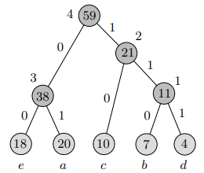

## 算法导论

这个文档是学习“算法设计与分析”课程时做的笔记，文档中包含的内容包括课堂上的一些比较重要的知识、例题以及课后作业的题解。主要的参考资料是 *Introduction to algorithms-3rd*(Thomas H.)（对应的中文版《算法导论第三版》），除了这本书，还有的参考资料就是 *Algorithms design techniques and analysis* (M.H. Alsuwaiyel)。

### 算法分析

在设计一个算法的时候，能够衡量，或者说至少能够做出有根据的陈述，算法的时间和空间复杂度是十分重要的。因为这样能够让我们从对某一个问题的多种可选解决方案中选择更好的一种，或者确定某种解决方案能够满足当前问题下的资源限制的要求。

在衡量时间复杂度的时候，想要预测出**绝对运行时间**是不现实的。因为算法运行的时间由很多因素决定，比如实现算法的编程语言，运行算法的机器，以及该机器上同时运行的其他的程序等。

因此，我们需要一种==机器无关的概念(Machine-independent notion)==来衡量算法的运行时间。

所以当前的算法分析主要是衡量算法的**相对运行时间**，也就是说当某个算法接收了一个长度为 *n* 的输入后，那么这个算法的相对运行时间就是达成完成输出所需要的抽象操作(Abstract Operations)的次数，我们以一个包含 *n* 的函数来表示这个算法的相对运行时间。

比如下面的这个例子：

```java
for(int i = 0; i < a.length; i++){
    System.out.println(a[i]);
}
```

这个算法接收的输入的长度为 *n = a.length* 是一个固定长度的输入，那么这个算法达成输出所需要的操作次数就为：

- 1 次变量 *i* 的初始化
- n 次 *i* 与 a.length的比较
- n 次 *i* 的增量计算
- n 次数组下标计算(to compute a[i])
- n 次调用函数 "System.out.println()" 的操作

所以这个算法的相对运行时间可以记为：T(n) = 4n + 1

但是在上面的计算中，每个操作所需的时间其实是并不相等的，比如比较操作和函数调用操作所需的时间明显是不同的。而调用函数需要的时间也是远远大于增量、比较和索引操作需要的时间，所以不妨把这些操作简化为一个操作，即"比较-索引-打印-增量"操作。那么这样的话，这个算法的时间复杂度就为：T(n) = n + 1。显然，一次初始化所需的时间并不是那么重要，所以可以进一步简化为：T(n) = n。

> 需要注意的是，这里之所以能够将算法的复杂度简化为 n ，是因为相较于打印操作，其他操作所花费的时间都是可忽略的。
>
> 这里记录一下我曾经在编程作业(C language)中犯的一个错误：假设 a 是一个字符串，其长度记为 n，现在要打印出这个字符串中的每一个字符。
>
> ```c
> for(i = 0; i < strlen(a); i++)
>     printf("%c ", a[i]);
> ```
>
> 那么这种情况下，算法的时间复杂度就应该是T(n) = 2n，因为在比较操作中调用了函数"strlen()"，这个函数会遍历整个字符串直到遇到 \'\0\' 才能计算出字符串的长度，所以每次比较操作都需要 n 次数组索引操作和比较操作。
>
> 所以这个时候的算法的时间复杂度为：T(n) = $n^2 + n$

这里的时间复杂度T(n) = n，有时候也可以记为$\lambda n.n$，即大小为n的输入，需要进行n次操作。


这里再介绍一个比较有趣的例子，计算两个方阵相乘(Multiply two square matrices)的结果：

给定两个方阵A, B，这两个方阵以二维数组的形式存储即 a\[n\]\[n\], b\[n\]\[n\]，然后输出一个新的矩阵c\[n\]\[n\]。

那么根据矩阵相乘的规则，可以得到下面的算法来计算两个矩阵相乘的结果：

```java
for(int i = 0; i < n; i++)
{
    for(int j = 0; j < n; j++)
    {
        double sum = 0;
        for(int k = 0; k < n; k++)
        {
            sum += a[i][k] * b[k][j];
        }
        c[i][j] = sum;
    }
}
```

从里向外看：

在k-loop中，一共有1次初始化以及n次循环，每次循环中有1次比较，1次递增，4次数组索引，1次乘法，1次加法以及1次赋值；

在j-loop中，有1次初始化，n次比较，n次递增，n次初始化，n次k-loop，n次赋值；

那么这是否意味着：T(j-loop) = n * (T(k-loop) + 4) + 1?

其实不然，因为相对于k-loop，其他的操作所花费的时间并不重要，所以通过类似的观点，我们可以忽略所有简单的for循环中的初始化、测试和递增操作。而在这个例子中，我们只需要考虑 sum += a[i][k] * b[k][j] 操作的次数，因为相比于其他操作，这个操作所需要的时间明显使更多的。

所以这个算法的时间复杂度就是：T(n) = $n^3$

但是，这里的 n 为输入的宽度，而不是输入的规模，真正的输入规模应该是$2n^2$

如果以输入规模来考虑这个算法的时间复杂度的话，那么得到的结果就与前面以输入的宽度来考虑的时间复杂度结果不一样了。

所以我们令 N = $2n^2$，那么T(N) = $N^{1.5}$

因此，使用不同的方法来衡量输入的大小，也会得到不同的结果。


再介绍一个例子，找到数组中某一个元素的位置：

```java
for(int i = 0; i < a.length; i++)
{
    if(a[i] == x)
    {
        return Optional.of(i);
    }
}
return Optional.empty();
```

那么这种场景下就需要分情况讨论了，比如最好的情况下，x = a[0]，那么B(n) = 1，最坏的情况下，x不在数组a中，那么W(n) = n。

那平均的时间复杂度是多少呢？这个其实就很难判断的，因为想要知道这个算法的平均时间复杂度，那么首先需要知道这些元素的期望分布。


到目前为止，我们可以分析一个算法的时间复杂度，将该算法的时间复杂度表示成一个与输入规模 *n* 相关的函数，但是如何通过比较时间复杂度函数来比较哪个算法更加优秀呢？


所以，我们可以将算法的时间复杂度按照其"增长率"对其进行分类，比如：

- 常数增长：时间复杂度是一个常量，即无论输入的规模如何，算法都只需要进行固定次数的操作，比如$\lambda n.1$
- 对数增长：时间复杂度是一个对数函数，即需要的操作次数与输入规模的对数成比例，比如$\lambda n.\log n$
- 多项式增长：时间复杂度是一个多项式，即需要的操作次数是输入规模的一个多项式，比如$\lambda n.n^k, k\ge 1$

- 指数增长：时间复杂度是一个指数函数，即需要的操作次数是输入规模的指数，比如$\lambda n.c^n,c>1$


所以，一般是通过算法时间复杂度的增长率来比较不同算法的性能的，但是函数的增长率依然的表示依然还是一个以 *n* 为变量函数，所以为了更方便比较不同函数的增长率通常会使用渐进的方法进行比较，比如一个函数可能会收敛于某个上界或者下界，然后我们就可以通过该函数收敛的上界与下界来比较不同的函数。

> When we look at input sizes large enough to make only the order of growth of the running time relevant, we are studying the asymptotic efficiency of algorithms. That is, we are concerned with how the running time of an algorithm increases with the size of the input in the limit, as the size of the input increases without bound. Usually, an algorithm that is asymptotically more efficient will be the best choice for all but very small inputs.
>
> -- *Introduction to algorithms*

如果对时间复杂度的增长率进行了衡量，那么我们通常会忽略掉

1. all but the "largest" term, and

2. any constant multipliers

比如：$\lambda n.0.4n^5 + 3n^3 + 254$的渐进表示就为$n^5$，只保留的最大的一项，并且忽略掉所有的常数倍数。

之所以会进行这样的忽略是因为下面的原因：

- 6n 和 3n 之间的差距其实是没有意义的，因为在一个运行速度是两倍的计算机上，可以让时间复杂度为 3n 的算法所花费的时间和在一个普通运行速度的计算机上的运行的时间复杂度为 6n 的算法所花费的时间一样；

- 2n 和 2n + 8之间的差距也是可忽略的，因为 n 可能会变得越来越大；
- 如果比较 $\lambda n.n^3$ 和$\lambda n.kn^2$的增长率，那么无论 k 取多大，总会存在一个N，使得$\forall n > N, n^3 > kn^2$


那么我们应该如何对时间复杂度的渐进表示进行形式化的表达？也就是如何能够通过一种形式化的方法找到一个时间复杂度表达式的渐进表示，比如$T(n) \in$ \{the set of all quadratic functions\}

#### Big-O: 渐进上界

**Def.** 称一个函数 *f* 属于 *O(g)* ，即$f \in O(g)$，当且仅当，存在常数 *c* 和 *N* 能够满足 $\forall n > N, f(n)$的上界为$g(n)$的常数倍，即：
$$
O(g) =_{def} \{f|\exist c,N. \forall n\gt N. |f(n)| \le c|g(n)|\}
$$
比如：$\lambda n.0.4n^5 + 3n^3 + 253\in O(\lambda n.n^5)$

为了简化，一般会丢弃Big-O中的lambda，	比如上面的这个例子就可以写成$O(n^5)$。

渐进上限能够让我们丢弃掉时间复杂度表达式中的较小的项以及常数因子。

比如：证明，$7n^4 + 2n^2+n+20\in O(n^4)$，
$$
\because n\ge 1\\
\begin{align}
|7n^4 + 2n^2 + n + 20| &\le 7n^4 + 2n^2 + n + 20\\
&\le 7n^4 + 2n^4 + n^4 + 20n^4\\
&\le 30n^4
\end{align}
$$
所以我们可以取常数 $c=30, N=1, \forall n > N,7n^4 + 20n^2 +n + 20 < c*n^4$


当输入的规模 *n* 比较大的时候，Big-O渐进上限是比较有用的。

但是==对于比较小的输入规模 *n*，Big-O中舍弃低阶项和常数因子的方法就存在误导性==，比如下面的函数：

$0.00001n^5 + 10^6 n^2$

当 *n* 比较小的时候如果将上面的函数的渐进表达为$O(n^5)$ 就不太恰当。

如果比较下面两个时间复杂度：

$8n\log n$  and  $0.01n^2$

会发现如果 n < 10701，那么前者是比后者更大的。

还需要注意的是，==Big-O只是上限，而不是严格的上限==。如果说一个函数属于$O(n^2)$，那么这个函数也属于$O(n^3)$, $O(n^{100})$或者$O(2^n)$。

#### Big-$\Omega$: 渐进下界

**Def.** 称一个函数 *f* 属于 $\Omega(g)$ ，即$f\in \Omega(g)$，当且仅当，存在常数 *c* 和 *N* 能够满足 $\forall n > N, f(n)$的下界为$g(n)$的常数倍，即：
$$
\Omega(g) =_{def} \{f|\exist c,N. \forall n\gt N. |f(n)| \ge c|g(n)|\}
$$
渐进下界是十分有用的，因为==渐进下界能够表示这个算法的执行至少需要这么多的时间==。

比如前面的打印数组的例子中，我们可以说这个算法的时间复杂度属于$O(2^n)$，因为$2^n$确实是这个算法时间复杂度的一个上限，但是不是一个严格的上限。但是我们也可以说这个算法的时间复杂度属于$\Omega(n)$，因为这个算法至少需要线性的时间来执行，这样更加准确。

当然，任何算法的时间复杂度都属于$\Omega(1)$。

#### Big-$\Theta$：紧渐进界

**Def.**如果一个函数的渐进上界和渐进下界是相等的，那么就可以使用Big-$\Theta$ 的概念：
$$
\Theta(g) =_{def} \{f|\exist c1,c2, N.\forall n > N.c1|g(n)| \le |f(n)| \le c2|g(n)| \}
$$
三种渐进分析的图形化表示如下图：


因此，我们就可以说打印数组的算法的时间复杂度属于$\Theta(n)$。


不是所有算法的时间复杂度都可以使用Big-$\Theta$ 来表示，比如$\lambda n.n^2\cos n$就不能使用Big-$\Theta $表示，因为这个时间复杂度没有渐进下界。

### 分治法

分治法(Divide-and-Conquer)是一种十分有用的算法思想，比如归并排序所体现出来的算法思想就是分治。

在分治的算法思想下，递归性地解决问题，在每一次递归都执行下面的三个步骤：

1. **Divide**: 将当前的问题划分为若干的子问题，这些子问题都是同一个问题的更小的实例，或者说是更小规模的相同问题
2. **Conquer**: 递归性地解决子问题，也就是将子问题传到下一层递归中。如果子问题的规模已经足够小了，那么就直接解决这个子问题
3. **Combine**: 将子问题的解决结果合并为当前问题的解决结果

这就是分治算法的基本思想，另外，在分治思想中还涉及到两个概念：

- recursive case: 就是当问题规模太大而无法直接解决，只能用递归解决的情况
- base case: 就是当问题规模足够小，能够直接解决的情况

比如归并排序就是一种比较典型的分治思想的算法，把对一个序列的排序工作划分成对两个子序列的排序工作：
$$
T(n) = 
\begin{cases}
\Theta(1) & if\space n=1\\
2T(n/2) + \Theta(n) & if\space n>1
\end{cases}
$$
即，如果序列的长度为1，那么就无需排序，需要的时间复杂度为$\Theta(1)$，而如果序列的长度大于1，那么就这个序列划分为两个子序列，并且对子序列进行排序，然后将排好序的子序列进行合并，合并两个有序的子序列需要的时间复杂度为$\Theta(n)$。

而上面的式子也被称为==递归式==。


#### 递归式求解

下面介绍如何求解递归式，也就是通过递归式计算算法整体的时间复杂度的方法：

比如说有下面这样的一个递归式：
$$
T(n) = \begin{cases}d & if\space n=1\\aT(n/b) + f(n) & if\space n>1\end{cases}
$$
在这个式子中，原问题被分解为a个子问题，每个子问题的规模为原来的 1/b 倍，而将这个a个子问题的解合并成原问题的解需要的时间为f(n)，而解决一个base case所需的时间为常数d。

最容易想到的方法就是对递归式进行展开：
$$
\begin{align}
T(n) &=aT(\frac{n}{b}) + f(n)\\
T(\frac{n}{b})&=a(\frac{n}{b^2}) + f(\frac{n}{b})\\
\cdots\\
T(n)&=a^kT(\frac{n}{b^k})+\sum_{i=0}^{k}a^if(\frac{n}{b^i})
\end{align}
$$
不过这样的方法比较抽象，可能需要分很多种情况进行讨论。

在 *Introduction to algorithm* 一书中，介绍了三种求解递归的方法，

- **substitution method**：猜测一个界限，然后使用数学归纳法来证明这个猜测是正确的
- **recursive-tree method**：使用递归树来，递归树中的节点表示在递归的各个级别上产生的成本，然后使用边界求和的方法来求解
- **master method**：可以用于计算形如$T(n) = aT(n/b) + f(n)$形式的递归式的边界，在这个式子中，原问题被分解为a个子问题，每个子问题的规模为原来的 1/b 倍，而将这个a个子问题的解合并成原问题的解需要的时间为f(n)

substitution method通常用于证明渐进上界和渐进下界，当然也可以用于证明紧渐进界。

这里介绍一个使用substitution method方法求解递归式的例子，递归式如下：
$$
f(n) = 
\begin{cases}
d & if\space n = 1\\
f(\lfloor n/2\rfloor)+f(\lceil n/2 \rceil) + bn & if\space n\ge 2
\end{cases}
$$
对于非负常数 *b* 和 *d*，如果 *n* 为2的整数幂，那么这个递归式可以简化为：

$f(n) = 2f(n/2) + bn$

那么我们可以假设:

$f(n) \le cbn\log n + dn$，其中 *c* 为大于0的常数，并且接下来将会确定 *c* 的值。

> 这部分的内容主要摘自 *Algorithms design techniques and analysis*，这里介绍了一些推论，用于假设递归式的边界，但是这里由于篇幅限制，所以没进行介绍。

假设上面猜测的结果在$n\ge 2$时，对于$\lfloor n/2 \rfloor$和$\lceil n/2 \rceil$是成立的，那么我们将其带入原式子右边的子式子可得：
$$
\begin{align}
f(n)  = & f(\lfloor n/2 \rfloor) + f(\lceil n/2 \rceil) + bn\\
\le & cb\lfloor n/2 \rfloor\log (\lfloor n/2 \rfloor) + d\lfloor n/2\rfloor + cb\lceil n/2 \rceil\log (\lceil n/2 \rceil) +d\lceil n/2 \rceil + bn\\
\le&cb\lfloor n/2 \rfloor\log (\lceil n/2 \rceil) + cb\lceil n/2 \rceil\log (\lceil n/2 \rceil) + dn + bn\\
=&cbn\log(\lceil n/2 \rceil) + dn + bn\\
\le&cbn\log ((n+1)/2) + dn + bn\\
=&cbn\log (n+1) - cbn + dn + bn
\end{align}
$$
欲使前面的假设成立，则有：
$$
\begin{align}
cbn\log (n+1) - cbn + dn + bn \le& cbn\log n + dn\\
cbn\log(n+1) - cbn + bn \le& cbn\log n\\
c\log (n+1) -c + 1\le& c\log n\\
c\ge& \frac{1}{1 + \log n - \log(n+1)} = \frac{1}{1 + \log\frac{n}{n+1}}
\end{align}
$$
当 $n\ge 2$时，

$\frac{1}{1+\log\frac{n}{n+1}} \le \frac{1}{1+\log\frac{2}{3}} \lt 2.41$

于是取c = 2.41。并且当n = 1时，$f(n) = d\le cb\log 1 + d = d$，假设依然成立。

**所以能够求解出上面递归式的上界为**：$f(n)\le 2.41 bn\log n + dn$

现在计算递归式的渐进下界，同样，假设递归式$f(n)$的下界为$cbn\log n + dn$，其中 *c* 为大于0的常数，后面会确定其取值。

假设上面的猜测在$n\ge 2$时，对于$\lfloor n/2 \rfloor$和$\lceil n/2 \rceil$ 是成立的，那么带入递归式右边可得：
$$
\begin{align}
f(n)=&f(\lfloor n/2 \rfloor) + f(\lceil n/2 \rceil) + bn\\
\ge&cb\lfloor n/2 \rfloor\log(\lfloor n/2 \rfloor) + d\lfloor n/2 \rfloor + cb\lceil n/2 \rceil\log(\lceil n/2 \rceil) + d\lceil n/2 \rceil + bn\\
\ge&cb\lfloor n/2 \rfloor\log(\lfloor n/2 \rfloor) + d\lfloor n/2 \rfloor + cb\lceil n/2 \rceil\log(\lfloor n/2 \rfloor) + d\lceil n/2 \rceil + bn\\
=&cbn\log (\lfloor n/2 \rfloor) + dn + bn\\
\ge&cbn\log(n/4) + dn +bn\\
=&cbn\log n - 2cbn + dn + bn
\end{align}
$$
欲使上面的假设成立，则有：
$$
\begin{align}
bn - 2cbn &\ge 0\\
c&\le \frac{1}{2}
\end{align}
$$
于是取 $c =\frac{1}{2}$，则当$n\ge 2$时，$f(n)\ge \frac{1}{2} bn\log n + dn$ 成立，并且当$n= 1$时，$f(n) = d \ge \frac{1}{2}b\log 1 + d =d$，假设依然成立。

**所以能够求出上面的递归式的下界为**：$f(n)\ge \frac{1}{2}bn\log n + dn$

综上，**上述递归式的紧渐进边界为**$f(n) =\Theta(n\log n)$ 

这种方法的困难在于提出一个巧妙的猜测，将这个猜测作为递归式的严格边界。然而，在多数情况下，给定递归式类似于另一个递归式，而这个递归式的解是已经提前知道了的，所以可以借助这个递归式的解，来假设当前递归式的解，上面介绍的这个例子就是这样的。

在上面的这个三个方法中，最常用并且也是最有用的方法就是主方法(master method)，这个方法通常用于计算递归式的渐进边界。

#### 主定理

主定理主要用于求解下面这种形式的递归式：

$T(n)=aT(n/b) + f(n)$

其中a, b是大于等于1的常数，而 *f(n)* 是一个渐进的正函数。

将T(n)分下面三种情况进行讨论：

- 若 $f(n) = O(n^{\log_b a-\epsilon})$，其中 $\epsilon > 0$，则 $T(n)=\Theta(n^{\log_b a})$
- 若 $f(n)=\Theta(n^{\log_b a})$，则 $T(n)=\Theta(n^{\log_b a}\lg n)$
- 若 $f(n)=\Omega(n^{\log_b a +\epsilon})$，其中 $\epsilon > 0$，并且如果 $af(n/b) \le cf(n)$，对于大于1的常数 *c* 以及足够大的 *n* 满足，则 $T(n)=\Theta(f(n))$

下面介绍一些使用主定理求解递归式的例子：


\# 1. $T(n) = 9T(n/3)+n$

则: $n^{\log_ba} = n^{\log_3 9}=n^2$

$f(n)=n=O(n^{\log_39 -\epsilon})$，其中$\epsilon =1$

根据主定理的第一个情况，$T(n)=\Theta(n^2)$


\# 2. $T(n)=T(2n/3)+1$

则: $n^{\log_ba}=n^{\log_{3/2}1} = 1$

$f(n) = 1 = \Theta(1)$

根据主定理的第二个情况，$T(n)=\Theta(n^{\log_{3/2}1}\lg n) = \Theta(\lg n)$


\# 3. $T(n)=3T(n/4)+n\lg n$

则: $n^{\log_b a} = n^{\log_43} = O(n)$

$f(n) = n\lg n = \Omega(n^{\log_43+\epsilon})$，其中$\epsilon = 1 - \log_43\approx 0.2$

所以可以应用主定理的第三种情况。

而$af(n/b) = 3(n/4)\lg(n/4) = (3/4)n\lg(n/4) \le (3/4)n\lg n = cf(n)$，其中 $c = 3/4$

根据主定理的第三种情况，$T(n) = \Theta(n\lg n)$


#### Selection Problem

选择问题(Selection Problem)：找到一个大小为 *n* 数组中的第 *k* 小的元素。

那么最直接的方法是，先将这个数组进行排序，然后取第 *k* 个元素，那么这样的方法的时间复杂度为$\Omega(n\log n)$，这也是所有基于比较的排序算法在最坏情况下的时间复杂度。

然而事实上，找到第 *k* 小的元素可以有线性时间复杂度的最优解。因为一个最简单的道理是，如果对原数组进行了排序，那么我们不仅能够找到第 *k* 小的元素，我们也能找到第 *k+1* 小的元素等，所以对数组进行排序的操作存在着一些冗余的工作量。

下面介绍这个问题最优解法的思路：

\- 如果数组中的元素数量小于44个（44是一个预定义的阈值，后面会解释为什么会将这个阈值），那么就直接对数组进行排序，然后找第 *k* 个元素

\- 否则，找到这个数组比较靠近"中间"的元素记为 *mm*，然后通过下面的方法将数组划分为三组：

​	- $A_1=\{a|a < mm\}$

​	- $A_2=\{a|a=mm\}$

​	- $A_3=\{a|a>mm\}$

​	那么，可以分下面几种情况讨论：

​	\#1. 若$|A_1| \ge k$，那么数组中第 *k* 小的元素必然在集合 $A_1$中，继续在 $A_1$ 中找第 *k* 小的元素

​	\#2. 若$|A_1| < k, |A_1| + |A_2|\ge k$，那么数组中第 *k* 小的元素就在 $A_2$ 中，所以第 *k* 小的元素就是 *mm*

​	\#3. 若$|A_1 + A_2| < k$，那么数组中第 *k* 小的元素必然在 $A_2$ 中，继续在$A_2$ 中找第 $k - |A_1| - |A_2|$ 小的元素

​	下面将介绍如何找到数组中靠近"中间"的元素：

​	将这个数组中每5个元素分为一组，如果数组长度不能被5整除，那么就丢弃剩下的元素。

​	找到每个小组的中位数，将这些中位数放在一个集合中，这个集合记为 *m*，那么我们要找的元素 *mm* 就是集合 	*m* 的中位数。

算法伪代码如下：


下面通过一个例子来演示这个算法的过程，并且为了方便演示而取消了阈值判断过程：

假设数组 A = \{ 8, 33, 17, 51, 57, 49, 35, 11, 25, 37, 14, 3, 2, 13, 52, 12, 6, 29, 32, 54, 5, 16, 22, 23, 7 \}

要找到数组A中的第13小的元素，也就是数组A的中位数。

先将A五五分组：

(8, 33, 17, 51, 57), (49, 35, 11, 25, 37), (14, 3, 2, 13, 52), (12, 6, 29, 32, 54), (5, 16, 22, 23, 7)

然后找到每个小组的中位数（注意到这里每个小组只有5个元素，所以找中位数的时间开销可以视为一个固定常数），并且放入集合中：M=\{ 33, 35, 13, 29, 16 \}

对 *M* 排序，M=\{ 13, 16, 29, 33, 35 \}，则 *mm* = 29

现在对原数组 *A* 进行划分：

$A_1=\{ 8, 17, 11, 25, 14, 3, 2, 13, 12, 6, 5, 16, 22, 23, 7 \}$

$A_2=\{ 29 \}$

$A_3=\{ 33, 51, 57, 49, 35, 37, 52, 32, 54 \}$

因为$|A_1| = 15 > 13$，所以丢弃$A_2,A_3$，在$A_1$ 中找第13小的元素。

令 $A = A_1$ 并五五分组：

(8, 17, 11, 25, 14), (3, 2, 13, 12, 6), (5, 16, 22, 23, 7)

找到每个小组的中位数，并且放入集合中：M = \{ 14, 6, 16 \}

则 *mm* =14

现在对数组 *A* 进行划分：

$A_1=\{ 8, 11, 3, 2, 13, 12, 6, 5, 7 \}$

$A_2=\{14\}$

$A_3=\{ 17, 25, 16, 22, 23 \}$

因为$|A_1| + |A_2| = 10 < 13$，所以丢弃$A_1, A_2$，在$A_3$ 中找第13-10=3小的元素

显然$A_3[3]=22$

所以原数组第13小的元素为22。

##### Algorithm analysis

显然，不难验证上面算法的正确性。

现在来分析上面这个算法的时间复杂度。

想要分析出分治算法的时间复杂度，那么就需要先确定其子问题的大小，如下图：


上图中，所有元素每列是按照从下往上递增排序的，然后将每列按照该列中位数的大小从左到右递增排序，那么对于整个集合的中间数 *mm*，图中左下角(*W*)的元素都是小于或等于 *mm* 的元素，图中右上角(*X*)的元素都是大于或等于 *mm* 的元素。

而这个算法中的子问题规模是所有严格小于中间数 *mm* 的元素集合( *A1* )大小，或者严格大于中间数 *mm* 的元素集合( *A3* )大小。现在考虑所有小于或等于中间数 *mm* 的集合( *A1'* )，显然，这个集合至少是和集合 *W* 一样大的。即：

$|A1'| \ge 3\lceil \lfloor n/5 \rfloor / 2 \rceil \ge \frac{3}{2}\lfloor n/5 \rfloor$

那么所有严格大于中间数 *mm* 的元素集合就是所有小于或等于中间数 *mm* 的元素集合的补集，即：

$|A3| \le n - \frac{3}{2}\lfloor n/5 \rfloor \le n - \frac{3}{2}(\frac{n-4}{5}) = n - 0.3n + 1.2 = 0.7 n + 1.2$

同理可得：

$|A1| \le n - \frac{3}{2}\lfloor n/5 \rfloor \le n - \frac{3}{2}(\frac{n-4}{5}) = n - 0.3n + 1.2 = 0.7 n + 1.2$

现在可以开始计算整个算法的时间复杂度了：

首先整个集合的规模( *n* )是知道的；将整个集合五五分组的时间复杂度是$\Theta(n)$；将每组的 5 个元素进行排序的时间复杂度是 $\Theta(n)$，因为对 5 个元素排序最多只需要 7 步，可以视为一个常数开销；找到所有中位数的中位数的开销是 $T(\lfloor n/5 \rfloor)$，使用这里的选择算法找中位数；在确定了中间数 *mm* 后，就可以进入子问题了，根据前面的分析，子问题的时间复杂度应该是 $T(0.7n + 1.2)$。即：

$T(n) = T(\lfloor n/5 \rfloor) + T(0.7 n + 1.2) + cn$

其中 *c* 为足够大的常数。

为了将 *0.7n+1.2* 转换成n的常数倍形式，这里假设:

$0.7n + 1.2 \le \lfloor 0.75n \rfloor$

当 $n = 44$时，$0.7n + 1.2 \le 0.75n - 1$ 成立。

因此，算法的时间复杂度为:

$$
T(n) = \begin{cases}
c& n < 44\\
T(\lfloor n/5 \rfloor) + T(\lfloor 3n/4 \rfloor) + cn &n\ge 44
\end{cases}
$$

因为 $\frac{1}{5} + \frac{3}{4} < 1$，所以算法的时间复杂度为 $T(n) = \Theta(n)$。

### 动态规划法

动态规划(Dynamic Programing)和分治法一样，通过合并子问题的解决结果来解决当前的问题。

前面已经介绍过，分治法是通过将问题拆分成若干个不相交的子问题，然后递归解决这些子问题，最后再将子问题的解决结果合并成原问题的解决结果。

与之相比，动态规划则是当子问题存在重叠部分的时候使用的，也就是说当若干个子问题(subproblems)都有一个共同的子子问题(sub-subproblems)的时候，分治法就没必要再使用了，因为这种情况下分治法会重复地解决同一个子子问题，所以这个时候就需要动态规划来解决。

需要注意的是，==无论是分治还是动态规划，其子问题都必须是可以独立求解的==，也就是说后面的子问题的解不会依赖前面的子问题的解。

动态规划对同一个子子问题只会解决一次，并且会将解决结果存放在一个表中，从而避免重复计算同一个子子问题。

动态规划通常用于最优解（更确切地说是全局最优解）问题，也就是说当前的问题可以有很多中解决方案，而每一个解决方案都有一定的值（或者说是收益），而我们希望能找到收益最大化的解决方案，并且将这样的解决方案称为最优解。

动态规划一般分为下面四个步骤：

1. **Characterize**: 刻画一个最优解的结构特征
2. **Define**: 递归定义最优解的值
3. **Compute**: 计算最优解的值，通常采用自底向上的方法
4. **Construct**: 利用计算出的信息构造一个最优解

这里介绍一个切割钢条(Rod cutting)的例子：假设现在有一个长度为n的钢条，现在要对其进行切割，钢条的价格与钢条的长度并不是线性相关的，比如：

| Length | Price |
| :----: | :---: |
|   1    |   1   |
|   2    |   5   |
|   3    |   8   |
|   4    |   9   |
|   5    |  10   |

现在问如何切割这跟钢条？使其能够买到最高的价格。

首先是要刻画最优解的结构特征，并递归定义最优解的值。

那么现在有一个问题就是：第一次切割应该如何切割才能让其收益最大化？

假设第一次切割后将钢条分为长度分别为 *i* 和 *n-i* 的两段钢条，那么这个时候钢条的收益可以记为：

$S(n) = p(i) + r(n-i)$

其中 *S(n)* 代表长度为 *n* 的钢条的此时的收益，*p(i)* 代表长度为 *i* 的钢条的直接售价，*r(n-i)* 代表长度为 *n-i* 的钢条的最大收益。

那么显然，长度为 *n* 的钢条的最大收益应该表示为：

$r(n) = \max_{i = 1, \dots n}(p(i)+ r(n-i))$

接下来的步骤就和分治思想比较相似了。

但是有一个需要注意的点是，在这个问题中，每个子问题之间是存在重叠的。比如在 *r(n-1)* 这个子问题中，包含的子问题有 *r(n-2), r(n-3), ...*，而在同一个递归层次的另一个子问题 *r(n-2)* 中，包含的子问题有 *r(n-3), r(n-4), ...*。

因为子问题之间的重叠性，所以在动态规划中通常采用自底向上的递归思路，并且还需要采用一个“备忘录”来避免重复计算同一个子子问题。例如在上面的这个例子中，可以使用一个长度为 *n* 的全局数组来保存每个子问题的解 即 *r(i)* 。

#### 最大公共子序列

这里将要介绍另一个例子，并且将通过这个例子介绍==最优子结构性质==与==子问题重叠性质==，这两个性质是动态规划中的两个关键的概念，通常能够使用动态规划解决的问题都具备这两种性质。

最大公共子序列问题，给定两个字符串 *A* 和 *B*，长度分别为 *n* 和 *m*，字母表记为 $\Sigma$，确定两个字符串的最大公共子序列，这里的最大公共子序列的定义是，只考虑子序列的顺序而不需要考虑子序列中的字符是否是相邻的。

比如给定两个序列，*A = zxyxyz*，*B = xyyzx*，那么他们的最大公共子序列就是 *xyyz*。

最简单的方法是使用暴力破解法：枚举字符串 *A* 的所有子序列，一共有 $2^n$ 个子序列。然后在字符串 *B* 中逐个搜索这些子序列，搜索每个子序列需要进行 *m* 次比较，能够搜索到的最大的子序列就是最大公共子序列， 那么这种方法的时间复杂度就是 $O(m 2^n)$ ，这是个指数增长的时间复杂度。

动态规划方法是基于递归的方法，因此，用使用动态规划的方法解决这个问题就需要找到解决这个问题的递归式。

令 $L[i,j]$ 表示序列 $a_1,\dots, a_i$ 和序列 $b_1, \dots, b_j$ 的最大公共子序列的长度。当这两个序列的其中或者两个都是空序列时，他们的最大公共子序列的长度为0，也就是说当 $i = 0$ 或者 $j = 0$ 时， $L[i,j] = 0$。

那么可以通过观察得出下面的结论：
- 若 $a_i = b_j$，则$L[i,j] = L[i - 1, j- j] + 1$
- 若 $a_i\ne b_j$，则$L[i,j] = \max\{ L[i, j-1], L[i-1, j] \}$

根据这样的规律，可以得出最大公共子序列的递归式：
$$
L[i,j] = \begin{cases}
0 & i\times j = 0\\
L[i - 1,  j - 1] + 1 &  i\times j \ne 0 && a_i = b_j\\
\max\{ L[i, j - 1], L[i - 1, j] \}&i\times j \ne 0 && a_i \ne b_j
\end{cases}
$$

递归式的思想就是，如果要得到两个序列的最大公共子序列，那么可以先计算它们的前缀的最大子序列，然后再比较这两个前缀后面的一个字符是否相同再来判断当前序列的最大公共子序列。

可以使用一个 $(n+1)\times(m+1)$ 的矩阵来保存 $L(i,j)$ ，其中 $0\le i \le n, 0\le j \le m$ 。

算法的伪代码如下：


可以看到这个算法的时间复杂度为 $\Theta(nm)$.

##### 最优子结构性质

如果一个问题是具有最优子结构性质的，那么就可以使用动态规划进行解决。或者说一个问题必须具备最优子结构性质才能够使用动态规划的方法求解。

下面演示如何证明最长公共子序列问题具有最优子结构性质。

*最优子结构性质可以理解为，如果一个问题的解的结构可以拆分成子问题的解，那么子问题的解一定是这个子问题的最优解。*

==最优子结构性质的证明方法通常是采用反证法进行证明。==

设 $X=(x_1, ..., x_n), Y=(y_1, ..., y_m)$ 是两个序列，它们的最长公共子序列为 $Z=(z_1, ..., z_k)$，那么：
I. 若 $x_n = y_m$ :
则 $z_k = x_n = y_m$，那么显然有：
$(z_1, ..., z_{k-1})$ 是 $(x_1, ..., x_{n-1})$ 和 $(y_1, ..., y_{m-1})$ 的最长公共子序列。
即$LCS(n,m) = LCS(n-1, m-1) + 1$
II. 若 $x_n\ne y_m$ :
那么可以分两种种情况讨论：
i. 若 $z_k \ne x_n$，那么可以证明 $Z$ 是 $(x_1, ..., x_{n-1})$ 和 $(y_1, ..., y_n)$ 的最长公共子序列。
反证法，假设 $(x_1, ..., x_{n-1})$ 和 $(y_1, ..., y_m)$ 的最长公共子序列为 $Z' = (z_1', ..., z_h')\ne Z$，那么因为 $x_n\ne y_m， x_n\ne z_k$ 所以$x_n$ 不会影响 $X$ 和 $Y$ 的最长公共子序列，因此，$Z'$ 也是$(x_1, ..., x_n)$ 与 $(y_1, ..., y_m)$ 的最长公共子序列，而这与前提条件 $Z$ 是 $(x_1, ..., x_n)$ 与 $(y_1, ..., y_m)$ 的最长公共子序列相矛盾，因此 $Z$ 必然是 $(x_1,...,x_{n-1})$ 和 $(y_1, ..., y_m)$ 的最长公共子序列。
即 $LCS(n,m) = LCS(n-1, m)$
ii. 若 $z_k\ne y_m$ ，那么同理可证 $Z$ 是 $(x_1, ..., x_n)$ 和 $(y_1, ..., y_{m-1})$ 的最长公共子序列。
即 $LCS(n,m) = LCS(n, m-1)$
最终，若 $x_n\ne y_m$，则 $LCS(n,m) = \max\{ LCS(n-1, m), LCS(n, m-1)\}$
综上，最长公共子序列问题具有最优子结构性质，子问题的递归结构如下：
$$
L[i,j] = \begin{cases}
0 & i\times j = 0\\
L[i - 1,  j - 1] + 1 &  i\times j \ne 0 && a_i = b_j\\
\max\{ L[i, j - 1], L[i - 1, j] \}&i\times j \ne 0 && a_i \ne b_j
\end{cases}
$$

##### 子问题的重叠性

分治思想与动态规划思想都是具有最优子结构性质的，但是动态规划与分治的一个区别在于，动态规划解决的问题是具有子问题重叠性质的，而分治解决的问题的子问题则是不重叠的。

最长公共子序列问题的子问题重叠性如下图所示：


可以看到组成最优解的不同子问题的解是有一定重合的，基于这样的性质，可以减少计算次数，将其中一个子问题的解记录下来，到另一个子问题需要用到这个解是就不需要再重新计算。

### 贪心法

与动态规划一样，贪心法通常用于解决最优解的问题。但是与动态规划不同的是，贪心法通常由试图找到==局部最优解==的迭代过程组成。

> 贪心法与动态规划的另一个区别在于，贪心法是迭代的，而动态规划是递归的。

贪心法得到的解并不总是全局的最优解。

贪心法得到的解决方案通常是一步一步的(step by step)，每一步都是在局部范围内在很少计算的基础上作出正确的猜测，而不用担心未来。

能够使用贪心法解决的问题通常具备两种性质：
1. 最优子结构
2. 贪心选择性

其中最优子结构性质和动态规划问题中的最优子结构性质是一样的。

而贪心选择性则是指一个问题的全局最优解可以通过局部最优解得到，或者说通过贪心法得到的解决方案是正确的，而这部分的证明通常是设计贪心算法最难的部分。

下面介绍一个简单的例子，背包问题。

假设现在有 *n* 件物品，每件物品的大小为 $s_1,...,s_n$ 每个物品的价值为 $v_1, ..., v_n$，现在有一个容量为 *C* 的背包来装这些物品，如何选择使得在背包容量的限制下装取的物品的价值总和最大？

这个问题使用贪心法就很好解决，先计算物品的性价比，$r_i = v_i / s_i$，然后将所有物品按照性价比由高到低排序，然后按照这个排序进行选择，直到背包容量已满。

*上面的这个方法就体现了贪心算法的局部最优性，迭代进行，每次都选择当前剩余物品中性价比最高的物品。*

#### Minimum Cost Spanning Trees(Kruskal)

贪心法一个比较经典的使用场景是最小生成树。

*最小生成树的定义*：设 *G = (V, E)* 是一个无向连通图(connected undirected graph)，并且每条边都有其权重。*G* 的一个生成树 *(V, T)* 是 *G* 的一个子图，并且是一个树，也就是说没有回路。如果 *T* 中每条边的权重之和是最小的，那么就称 *(V, T)* 是最小代价生成树(Minimum Cost Spanning Trees)，或者最小生成树(Minimum Spanning Trees)。

Kruskal 的方法原理是，维护一个由几个生成树组成的森林，然后将森林中的生成树逐渐合并，直到将所有生成树合并成一个树，这个树就是最小生成树。

算法的具体步骤分为两步：
1. 将 *G* 中所有的边按递增的顺序排序；
2. 迭代选择图中的边，每次都选择最短的一条边：对于有序列表中的每一条边，如果这条边没有与 *T* 中的边构成回路，就将其放入 *T* 中；否则就丢弃这条边。

下面给出一个列子：


##### 实现

Kruskal 的最小生成树算法的实现需要使用并查集(Disjoint Set) 来判断当前的树中是否包含回路。

并查集相当于是一个森林，通常由数组实现，`disjoint_set[i]` 表示元素 *i* 的父节点，如果父节点是其本身，那么就意味着这个节点是其所在的树的根节点。初始阶段，每个节点的父节点都是其本身，然后通过合并而形成一个树。

并查集常用的有两种操作：查，找到目标元素所在的树的根节点；并，将两个两个不同的树合并成一个树。

Kruskal's algorithm：


上图给出了该算法实现的伪代码，其中的 *MAKESET()* 是指初始化一个并查集。

##### 正确性

下面证明 Kruskal 算法的正确性。

> 需要使用到的定理：
> If T is a tree with n vertices, then
> (a) Any two vertices of T are connected by a unique path.
> (b) T has exactly n − 1 edges.
> (c) The addition of one more edge to T creates a cycle.

使用数学归纳法求证，对最小生成树所包含的边的集合 *T* 的大小进行归纳：
 
> 贪心问题的贪心选择性的证明常用数学归纳法求证。

最初，*T = \{ \}* ，那么 *T* 显然是 *T\** 的一个子集。其中 *T\** 是最小生成树 *G\* = (V, T\*)* 中的边的集合。

假设 $T\subset T^*$。随后，在使用Kruskal算法添加一条边 *e = (x, y)* 到 *T* 中之前，令 *X* 为包含节点 *x* 的子树节点的集合。

令 $T' = T\cup \{e\}$，可以证明 *T'* 依然是 *T\** 的一个子集：

i. 如果 $e\in T^*$，那么 $T'\subset T^*$ 显然成立。
ii. 如果 $e\notin T^*$，则：
根据上面的定理，$T^* \cup \{ e\}$ 中会包含一个回路，而 *e* 正是这个回路中的一条边。而 *e = (x, y)* 连接了 *X* 中的一个节点和 *V-X* 中的一个节点。那么 *T\** 中也必然存在一条边 *e' = (w, z)* ，其中 $w\in X, z \in V-X$，才能在 *T\** 中形成回路。
那么有 $cost(e') \ge cost(e)$，否则根据Kruskal算法 *e'* 会先于 *e* 加入 *T*。现在构造 $T^{**} = (T^* - \{e'\}) \cup \{e\}$，那么 $T'\subset T^{**}$。
此外，$T^{**}$ 也是包含最小生成树中所有边的集合，因为 *e* 是连接 *X* 中的节点与连接 *V - X* 中的节点的最短路径。
即 $T\cup \{e\}$ 依然是最小生成树中所有边的集合的子集。

那么根据归纳法，通过Kruskal算法添加边得到的集合一定都是最小生成树所有边的集合的子集，直到这个集合的边能够连通 *V* 中的所有节点，得到最小生成树。

#### Minimum Cost Spanning Trees(Prim)

解决最小生成树问题还有另一个算法——Prim's algorithm。这个算法与Kruskal的算法完全不同，但同样也是使用贪心的策略进行决策。

Prim的算法以图中的任意一点为起点来生成最小生成树。令 *G=(V, E)* 为一个连通无向图，将 *V* 中节点编号为 *{1, ..., n}*，初始时，令 *X = {1}, Y = {2, ..., n}*，算法依然是迭代进行，每次迭代添加一条边，而这条边是节点 $x\in X, y\in Y$ 的最短路径 *(x, y)*。添加这条边到最小生成树中所有边的集合 *T* 中，并且将节点 *y* 从集合 *Y* 中移除并加入到集合 *X*。不断迭代，直到集合 *Y* 为空集，得到最小生成树。

步骤如下：
1. $T\gets \{\}, X\gets \{1\}, Y\gets V - \{1\}$
2. 令 *(x,y)* 为集合 *X* 到集合 *Y* 中节点的最短路径，则 $X\gets X\cup \{y\}, Y\gets Y-\{y\}, T\gets T\cup \{(x,t)\}$
3. 重复步骤2，直到 $Y=\{\}$

下面给出一个例子：


##### 实现
Prim的算法使用邻接矩阵来实现，即矩阵 `c[i,j]` 表示边 *(i, j)* 的长度。然后使用 `boolean` 类型的一维数组 `X[n], Y[n]` 来表示集合 *X, Y*:


上图为Prim算法的伪代码。

##### 正确性

下面证明Prim算法的正确性。

同样的，使用归纳法进行证明。对集合 *T* 的大小进行归纳，可以证明 *(X, Y)* 是图 *G* 最小生成树的一个子树。

起初，*T = \{ \}*，上面的结论显然成立。

假设上面的结论在添加一条边 *e = (x, y)* 到集合 *T* 之前都是成立的，即 *(X, T)* 是最小生成树的一个子树，其中 $x\in X, y\in Y$。令 $X' = X\cup \{y\}, T' = T\cup \{e\}$，那么可以证明，*{X', T'}* 依然是图 *G* 最小生成树的一个子树。

首先证明 *(X', T')* 是一个树。因为 $y\notin X$，并且 *(X, T)* 本身是一个树，所以边 *e = (x, y)* 不会在 *T'* 中构成回路，即 *(X', T')* 是一个树。

现在证明 $T' = T\cup \{e\}$ 是 *G* 的最小生成树的一个子树。设图 *G* 的最小生成树为 *G\* = (V, T\*)*。
i. 若 $e\in T^*$ ，那么结论显然成立。
ii. 若 $e\notin T^*$，那么根据前面的定理，$T^*\cup \{e\}$ 必然包含一个回路。
这也就意味着 *T\** 中包含一条边 $e' = (w, z), w\in X, z\in Y$。
那么根据 Prim 算法，只有$cost(e') \le cost(e)$ 才能够使 $e'\in T^*$，而这与 *e* 是集合 *X* 与集合 *Y* 节点间最短路径的前提矛盾。所以必然有 $e\in T^*$。
因此 $T' = T\cup \{e\} \subset T^*$

综上，使用Prim算法得到的集合 *(X, T)* 是图 *G* 最小生成树的一个子树，直到 *Y = \{\}* 时，得到最小生成树。

#### Huffman编码

贪心法的另一个比较经典的使用案例是用于文件压缩的Huffman编码。

假设现在有一个文件，由字符串组成。现在希望尽可能多地压缩这个文件，并且能够轻易还原。假设文件中的字符集合为 $C = \{c_1, ..., c_n\}$，令 $f(c_i)$ 为字符 $c_i$ 在文件中出现的频率，也就是出现的次数。

以固定长度的比特串来表示每个字符，也就是字符编码，那么文件的大小就取决于文件包含的字符总数。

然而，为了减小文件的大小，因为文件中某些字符出现的频率会远高于其他字符，所以可以考虑使用变长(variable-length)的编码方式，并且为出现次数比较高的字符分配更短的比特进行编码。

在变长编码中，需要注意某个字符的编码一定不能是另一个字符编码的前缀，这样的编码方式称为前缀编码(prefix codes)。比如，如果对字符 'a' 的编码为 "10"， 对字符 'b' 的编码为 "101" 那么在扫描文件的时候就会出现二义性，也就是说 "10" 应该解释为字符 'a' 还是字符 'b' 的前缀呢？

如果编码方式满足了这样的限制，那么扫描文件时可以用下面的方式进行正确解码。使用一个完全二叉树，每个节点连接子节点的两条边分别标记为0,1，树的叶子节点就表示一个字符，而从根节点到叶子节点的路径上的01序列就是该字符的编码。

通过Huffman算法，能够构造出满足非前缀编码的编码方式，并且能够将文件的大小压缩到最小。

Huffman算法也是迭代进行的，令 *C* 表示所有字符的集合，选择出现频率最低的两个字符 $c_i, c_j$，创造一个新的节点 *c* 作为这个节点父节点，并且令 *c* 的出现频率为这两个子节点出现频率之和。然后从集合 *C* 中移除节点 $c_i, c_j$，并加入节点 *c*。重复这样的步骤，直到集合 *C* 只包含一个根节点。


上图为Huffman算法的伪代码。

下面看一个例子，假设一个文件由字符 'a', 'b', 'c', 'd', 'e' 组成，并且假设每个字符出现的频率分别为：*f(a) = 20, f(b) = 7, f(c) = 10, f(d) = 4, f(e) = 18*，找到一种编码方式使文件的大小压缩到最小。

使用Huffman算法可以构造出如下的完全二叉树：



从图中可以看出每个字符的编码：*e(a) = 00, e(b) = 111, e(c) = 10, e(d) = 110, e(e) = 01*，这样的变长编码能够满足非前缀编码限制，所以也不存在二义性，能够被正确解码。

如果使用固定长度的编码方式，那么每个字符至少需要3比特才能编码，那么文件的长度也就是 3*(20 + 7 + 10 + 4 + 18) = 177 bits；如果使用这里得到的编码方式进行编码，那么文件的长度就是 2 * 20 + 3 * 7 + 2 * 10 + 3 * 4 + 2 * 18 = 129 bits，这样可以将文件压缩27%。

### 回溯法


### 分支界限法


NP完全问题

NP问题

NP完全问题

NP完全问题证明方法


并不是所有的问题都是可以计算的

并不是所有


NP问题：非确定图灵机在多项式时间内可计算的问题

